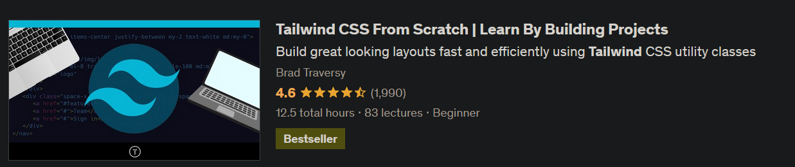

---

<h1 align="center"><code> SN-UT2S28-1 </code></h1>
<h2 align="center"><i> Continuation of main one T </i></h1>

---

1. [W ?](#w-)
2. [Coms](#coms)
   1. [NextJS 13 \&\& Tailwind CSS Pretty](#nextjs-13--tailwind-css-pretty)
3. [Dira](#dira)
4. [Ref](#ref)
5. [Animations](#animations)
6. [Buttons](#buttons)

---

# W ?

> This is contiuation of the main one being used when juice over and using new juice

# Coms

## NextJS 13 && Tailwind CSS Pretty

```sh
pnpm dlx create-next-app@latest
pnpm i -D prettier prettier-plugin-tailwindcss
```

# Dira

|         N         |              ?              |
| :---------------: | :-------------------------: |
| [`tc28`](./tc28/) |    $workis \ actualis $     |
| [`twcp`](./twcp/) | Referential stinky mistress |

# Ref

[`https://github.com/bradtraversy/tailwind-course-projects`](https://github.com/bradtraversy/tailwind-course-projects)

- Tuta files for referencington

# Animations

> This page has sexy animation, from [`https://react-awesome-reveal.morello.dev/docs/getting-started`](https://react-awesome-reveal.morello.dev/docs/getting-started)- Very easy to use and no overhead
> Smooth and sexay

# Buttons 

> Sexy buttons are taken from [`https://flowbite.com/docs/components/buttons/`](https://flowbite.com/docs/components/buttons/) - Straight forward TW , nothing additional to import